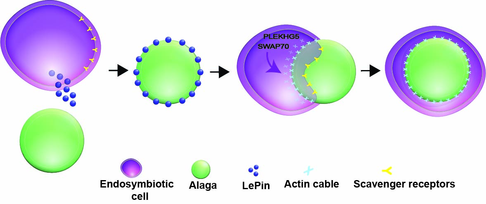

# Discovery of regulators for early steps of endosymbiosis in the soft coral *Xenia sp.*

## Introduction

This repository contains the code and analyses associated with a RNAi study of *Xenia sp.* presented in the following manuscript:

> Minjie Hu, Yun Bai, Xiaobin Zheng, Yixian Zheng (2022) # Discovery of regulators for early steps of endosymbiosis in the soft coral *Xenia sp.*

Raw data for scRNA-seq are accessible at SRA (Bioproject: PRJNA869069)

Selected/final R analysis objects are available from [figshare](https://figshare.com/articles/dataset/Processed_R_objects_for_LePin_RNAi_/20481900)

## Description of files in the repository

R Markdown documents with analysis code.

`01CreateSeuratObject.Rmd` 
- Filter data and create Seurat object for each scRNA library

`02LabelTransfer_DoubletFinder.Rmd` 
- Annotate each cluster according to previous non-regeneration scRNA-data which can be download [here](https://cmo.carnegiescience.edu/endosymbiosis/data/non_regeneration_integrated.RDS). The potential doublets are predicted by DoubletFinder.

`03SymbioticTrajectory.Rmd` 
- Predict the endosymbiotic cell trajectory by Monocle. 

`04NMFAnalysis.Rmd` 
- Identify other potential endosymbiosis initiation regulators by NMF.

`alga_counting` 
- Folder containing alga counting script
